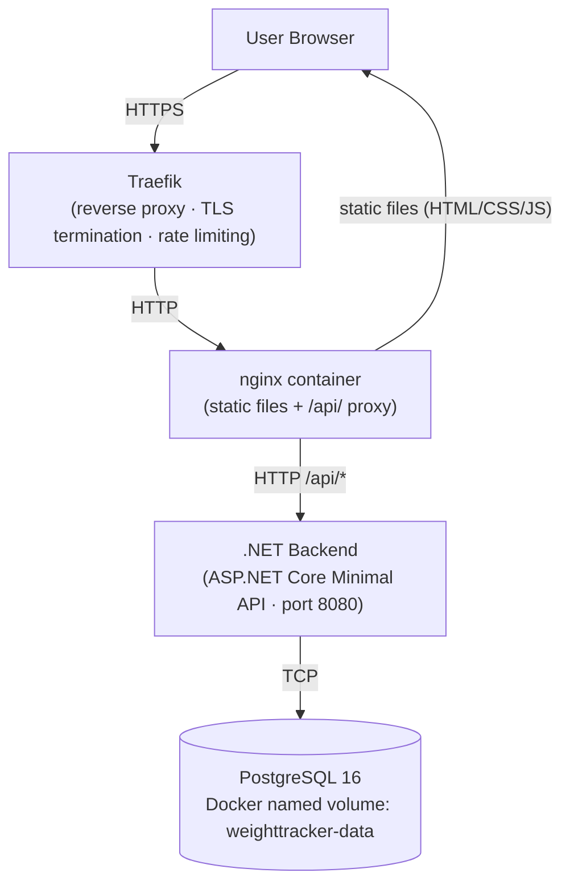
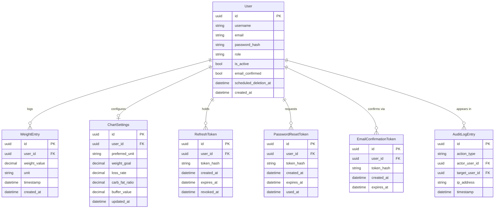

# Architecture: Weight Tracker

> **Architecture as of feature 018 (offline-first PWA).** Features introduced after 018 may add
> new patterns — check `specs/` for spec files numbered above 018 to find patterns not covered
> here. Sections 1–18 describe the 016 baseline; Section 19 covers the offline-first data flow
> added in 018.

This document serves two audiences equally:

- **Human developers** joining the project: read top-to-bottom on first join, then use it as a
  reference when adding new features.
- **AI coding sessions** (Claude Code, etc.): this document is designed to be loadable as context.
  The most critical rules are also in `CLAUDE.md`, which is auto-loaded every session.

---

## Table of Contents

1. [Repository Structure](#1-repository-structure)
2. [Backend: Ports & Adapters](#2-backend-ports--adapters)
3. [Backend: Repository Pattern](#3-backend-repository-pattern)
4. [Backend: Dependency Injection](#4-backend-dependency-injection)
5. [Backend: Auth Flow (JWT + Refresh Tokens)](#5-backend-auth-flow-jwt--refresh-tokens)
6. [Backend: EF Core + Testcontainers](#6-backend-ef-core--testcontainers)
7. [Backend: Adding a New Feature](#7-backend-adding-a-new-feature)
8. [Frontend: Module Overview](#8-frontend-module-overview)
9. [Frontend: api-client.ts](#9-frontend-api-clientts)
10. [Frontend: auth-guard.ts](#10-frontend-auth-guardts)
11. [Frontend: Tailwind CSS v4 + DaisyUI v5](#11-frontend-tailwind-css-v4--daisyui-v5)
12. [Frontend: Vite Build Setup](#12-frontend-vite-build-setup)
13. [Docker Compose & Runtime Config](#13-docker-compose--runtime-config)
14. [Worked Example: Adding a "Note" Entity](#14-worked-example-adding-a-note-entity)
15. [Architecture Decisions: Rationale Index](#15-architecture-decisions-rationale-index)
16. [System Overview](#16-system-overview)
17. [Technology Stack](#17-technology-stack)
18. [Data Model](#18-data-model)
19. [Frontend: Offline-First Data Flow](#19-frontend-offline-first-data-flow)

---

## 1. Repository Structure

```text
weight-tracking/
│
├── backend/                          # .NET 8 solution
│   ├── WeightTracker.Domain/         # Pure C# entities + interfaces — zero external dependencies
│   │   ├── Entities/                 # WeightEntry.cs, User.cs, RefreshToken.cs, ...
│   │   └── Interfaces/
│   │       ├── Repositories/         # IWeightEntryRepository.cs, IUserRepository.cs, ...
│   │       └── Services/             # ITokenService.cs, IEmailService.cs, ...
│   │
│   ├── WeightTracker.Infrastructure/ # EF Core, repositories, services, seeding
│   │   ├── Data/
│   │   │   └── AppDbContext.cs       # DbContext with all DbSets + OnModelCreating
│   │   ├── Repositories/             # WeightEntryRepository.cs, UserRepository.cs, ...
│   │   └── Services/                 # JwtTokenService.cs, BcryptPasswordHasher.cs, ...
│   │
│   ├── WeightTracker.Api/            # ASP.NET Core Minimal API — entry point
│   │   ├── Endpoints/                # EntryEndpoints.cs, AuthEndpoints.cs, ...
│   │   ├── Middleware/               # CurrentUserMiddleware.cs
│   │   └── Program.cs                # DI registration + middleware pipeline + startup
│   │
│   └── WeightTracker.Tests/          # All xUnit tests — never in other projects
│       ├── Integration/              # Endpoint + repository tests (Testcontainers PostgreSQL)
│       └── Unit/                     # Pure domain/service logic tests (no DB)
│
├── frontend/                         # TypeScript + Vite + Tailwind CSS v4 + DaisyUI v5
│   ├── src/
│   │   ├── ts/                       # TypeScript modules
│   │   │   ├── api-client.ts         # Typed HTTP calls + silent token refresh
│   │   │   ├── auth-guard.ts         # Auth state check + page redirect logic
│   │   │   ├── auth-token.ts         # In-memory Bearer token storage + JWT decode
│   │   │   ├── config.ts             # Runtime API URL loader (reads /config.json)
│   │   │   ├── theme.ts              # System dark/light detection + data-theme setter
│   │   │   ├── model.ts              # Shared TypeScript types + validation functions
│   │   │   ├── main.ts               # Dashboard page logic
│   │   │   └── ...                   # One module per page (admin.ts, profile.ts, etc.)
│   │   ├── css/
│   │   │   └── main.css              # @import "tailwindcss" + @plugin "daisyui"
│   │   └── *.html                    # Multi-page entry points (index, login, setup, ...)
│   ├── public/
│   │   ├── config.json.template      # {"apiUrl": "${API_URL}"} — envsubst source
│   │   └── icons/                    # PWA icons
│   ├── vite.config.ts
│   ├── vitest.config.ts
│   └── package.json
│
├── docker-compose.yml                # Full stack: db + backend + frontend
├── CLAUDE.md                         # AI session context (auto-loaded by Claude Code)
└── ARCHITECTURE.md                   # This file
```

---

## 2. Backend: Ports & Adapters

The backend is structured as three concentric layers:

```
┌─────────────────────────────────────────────────────┐
│  WeightTracker.Api                                  │
│  (ASP.NET Core Minimal API — orchestrates DI)       │
│  ┌───────────────────────────────────────────────┐  │
│  │  WeightTracker.Infrastructure                 │  │
│  │  (EF Core, SMTP, BCrypt — implements Domain)  │  │
│  │  ┌─────────────────────────────────────────┐  │  │
│  │  │  WeightTracker.Domain                   │  │  │
│  │  │  (Entities + Interfaces — zero deps)    │  │  │
│  │  └─────────────────────────────────────────┘  │  │
│  └───────────────────────────────────────────────┘  │
└─────────────────────────────────────────────────────┘
```

**Domain** (`WeightTracker.Domain`) has **zero external package references**. It contains only:
- Entity classes (`WeightEntry`, `User`, `RefreshToken`, etc.)
- Repository and service interfaces (`IWeightEntryRepository`, `ITokenService`, etc.)

**Infrastructure** (`WeightTracker.Infrastructure`) implements every Domain interface using
concrete technology:
- `WeightEntryRepository : IWeightEntryRepository` — EF Core + PostgreSQL
- `JwtTokenService : ITokenService` — Microsoft.IdentityModel.Tokens
- `BcryptPasswordHasher : IPasswordHasher` — BCrypt.Net-Next
- `SmtpEmailService : IEmailService` — MailKit

**Api** (`WeightTracker.Api`) wires everything together via ASP.NET Core's DI container and
defines endpoint route groups. It references both Domain (for types) and Infrastructure (for
registrations), but endpoint handlers only speak to Domain interfaces — they never instantiate
Infrastructure classes directly.

**Why this structure?**

1. **Testability**: Integration tests can swap the real Infrastructure for a test variant
   (e.g., `FakeEmailService`) without touching any Domain or Api code.
2. **Replaceability**: Switching from EF Core to Dapper, or from SMTP to SendGrid, requires
   only a new Infrastructure class — Domain and Api are unchanged.
3. **ORM isolation**: EF Core types (`DbSet`, `DbContext`) never leak into Domain or endpoint
   handlers. Domain entities are plain C# objects. This prevents accidental lazy-loading bugs
   and keeps the domain model honest.

---

## 3. Backend: Repository Pattern

Every data-access operation goes through a repository interface defined in Domain.

**Interface** lives in `WeightTracker.Domain/Interfaces/Repositories/`:

```csharp
// WeightTracker.Domain/Interfaces/Repositories/IWeightEntryRepository.cs
public interface IWeightEntryRepository
{
    Task<IEnumerable<WeightEntry>> GetAllAsync(Guid userId);
    Task<WeightEntry> AddAsync(WeightEntry entry);
    Task<bool> DeleteAsync(Guid id, Guid userId);
    Task DeleteAllAsync(Guid userId);
}
```

**Implementation** lives in `WeightTracker.Infrastructure/Repositories/`:

```csharp
// WeightTracker.Infrastructure/Repositories/WeightEntryRepository.cs
public class WeightEntryRepository(AppDbContext db) : IWeightEntryRepository
{
    public async Task<IEnumerable<WeightEntry>> GetAllAsync(Guid userId) =>
        await db.WeightEntries
            .Where(e => e.UserId == userId)
            .OrderByDescending(e => e.Timestamp)
            .ToListAsync();

    // ... other methods
}
```

Key points:
- **Primary constructor injection** (`(AppDbContext db)`) is used throughout — no field
  declarations, no `this.db = db` assignments.
- All queries are **user-scoped**: every method takes `userId` and filters by it. No
  repository method returns data across users.
- `AppDbContext` is injected — repositories never call `new AppDbContext(...)`.

**Why?** Domain entities must never reference EF Core. If `WeightEntry.cs` imported
`Microsoft.EntityFrameworkCore`, the Domain project would gain an external dependency and
lose its isolation guarantee. The interface boundary enforces this: Domain only defines
*what* can be done, Infrastructure defines *how*.

---

## 4. Backend: Dependency Injection

All services and repositories are registered as **Scoped** in `WeightTracker.Api/Program.cs`.
Scoped means one instance per HTTP request, which is the correct lifetime for `AppDbContext`
(EF Core's DbContext is not thread-safe and must not be shared across requests).

**Registration pattern:**

```csharp
// WeightTracker.Api/Program.cs
builder.Services.AddDbContext<AppDbContext>(options =>
    options.UseNpgsql(connectionString));

// Repositories
builder.Services.AddScoped<IWeightEntryRepository, WeightEntryRepository>();
builder.Services.AddScoped<IUserRepository, UserRepository>();
builder.Services.AddScoped<IRefreshTokenRepository, RefreshTokenRepository>();
// ... all other repositories

// Services
builder.Services.AddScoped<ITokenService, JwtTokenService>();
builder.Services.AddScoped<IPasswordHasher, BcryptPasswordHasher>();
builder.Services.AddScoped<IEmailService, SmtpEmailService>();
builder.Services.AddScoped<ICurrentUserResolver, JwtCurrentUserResolver>();
// ... all other services
```

**Injection into endpoint handlers** uses primary constructors throughout:

```csharp
// Services injected into other services
public class UserManagementService(
    IUserRepository users,
    IPasswordHasher hasher,
    IEmailService email,
    IAuditLogRepository audit) : IUserManagementService
{
    // ...
}
```

**Endpoint handlers** receive services via handler parameters (Minimal API resolves them from
the DI container automatically):

```csharp
group.MapPost("", async (
    HttpContext httpContext,
    EntryRequest request,
    IWeightEntryRepository repository,
    IChartCalculationService chartService) =>
{
    // ...
});
```

**Why Scoped?** `AppDbContext` tracks entity state within a request. Using Singleton would
cause state corruption across concurrent requests. Transient would create a new DbContext per
injection point within a request (multiple contexts = transaction issues). Scoped is the
standard, correct choice for EF Core.

---

## 5. Backend: Auth Flow (JWT + Refresh Tokens)

The auth system uses short-lived JWT access tokens paired with longer-lived refresh tokens
stored server-side. Here is the complete flow:

### Login

```
POST /api/auth/login  { username, password }
  → Verify password (BCrypt)
  → Check EmailConfirmed = true (else 401)
  → Update LastLoginAt
  → Write AuditLog entry
  → Generate access token (JWT, 15 min expiry, HMAC SHA256)
  → Generate refresh token (random bytes → SHA256 hash → lowercase hex, 7 day expiry)
  → Store hashed refresh token in RefreshTokens table
  → Response: { accessToken: "eyJ..." }
             Set-Cookie: refreshToken=<raw>; HttpOnly; SameSite=Strict; Path=/api/auth/refresh
```

The **access token** (JWT) contains claims:
- `sub`: user ID (Guid)
- `role`: "user" or "admin"
- Issuer: `"weight-tracker"`, Audience: `"weight-tracker-api"`
- Signed with HMAC SHA256 using `JWT_SECRET` environment variable

The **refresh token** is a random value stored only as its SHA256 hash in the database.
The raw value is sent in an HTTP-only cookie scoped to `/api/auth/refresh`. Even if an attacker
reads the database, they cannot use the hash to make API calls.

### Silent Refresh

```
POST /api/auth/refresh  (cookie: refreshToken=<raw>)
  → Hash the raw cookie value (SHA256 → lowercase hex)
  → Look up hash in RefreshTokens table
  → Verify not expired, not revoked
  → Revoke old token (delete from DB)
  → Issue new access token + new refresh token (rotation)
  → Response: { accessToken: "eyJ..." }
             Set-Cookie: refreshToken=<new-raw>; HttpOnly; ...
```

Rotation means: every refresh request invalidates the old refresh token and issues a new one.
If a stolen refresh token is used, the legitimate user's next refresh will fail, revealing the
theft.

### Using the Current User in Endpoints

`CurrentUserMiddleware` runs on every authenticated request:

```csharp
// WeightTracker.Api/Middleware/CurrentUserMiddleware.cs
var userId = Guid.Parse(context.User.FindFirstValue(ClaimTypes.NameIdentifier)!);
context.Items["CurrentUserId"] = userId;
```

**In every endpoint handler, extract the user ID like this:**

```csharp
var userId = (Guid)httpContext.Items["CurrentUserId"]!;
```

**Never read JWT claims directly in endpoint handlers.** The middleware is the single
extraction point. This prevents scattered claim-parsing logic and makes it trivial to change
the claim name or source in one place.

---

## 6. Backend: EF Core + Testcontainers

All backend integration tests use a **real PostgreSQL database** spun up in a Docker container
by Testcontainers. There are no database mocks anywhere in the test suite.

### ApiFixture

```csharp
// WeightTracker.Tests/Integration/Fixtures/ApiFixture.cs
public class ApiFixture : WebApplicationFactory<Program>, IAsyncLifetime
{
    private PostgreSqlContainer _postgres = new PostgreSqlBuilder()
        .WithImage("postgres:16-alpine")
        .Build();

    public async Task InitializeAsync()
    {
        await _postgres.StartAsync();
        // Override DB connection string with test container's connection string
    }

    public async Task DisposeAsync() => await _postgres.StopAsync();

    public HttpClient CreateAuthenticatedClient(string role = "user")
    {
        var token = GenerateTestJwt(/* test user ID */, role);
        var client = CreateClient();
        client.DefaultRequestHeaders.Authorization =
            new AuthenticationHeaderValue("Bearer", token);
        return client;
    }

    public HttpClient CreateAuthenticatedAdminClient() =>
        CreateAuthenticatedClient(role: "admin");
}
```

### Test class pattern

```csharp
// WeightTracker.Tests/Integration/Endpoints/EntryEndpointsTests.cs
public class EntryEndpointsTests : IClassFixture<ApiFixture>
{
    private readonly HttpClient _client;

    public EntryEndpointsTests(ApiFixture fixture)
    {
        _client = fixture.CreateAuthenticatedClient();
    }

    [Fact]
    public async Task PostEntry_ValidRequest_Returns201()
    {
        var request = new { weightValue = 75.5, unit = "kg", timestamp = DateTime.UtcNow };
        var response = await _client.PostAsJsonAsync("/api/entries", request);
        Assert.Equal(HttpStatusCode.Created, response.StatusCode);
    }
}
```

### Test file naming convention

Test file paths mirror source paths:

| Source file | Test file |
|-------------|-----------|
| `WeightTracker.Infrastructure/Repositories/WeightEntryRepository.cs` | `WeightTracker.Tests/Integration/Repositories/WeightEntryRepositoryTests.cs` |
| `WeightTracker.Api/Endpoints/EntryEndpoints.cs` | `WeightTracker.Tests/Integration/Endpoints/EntryEndpointsTests.cs` |
| `WeightTracker.Infrastructure/Services/JwtTokenService.cs` | `WeightTracker.Tests/Unit/Services/JwtTokenServiceTests.cs` |

**Why Testcontainers instead of mocks?** A previous incident where mocked database tests
passed but a production migration failed — the mock did not reproduce a constraint that
PostgreSQL enforces. Testcontainers runs the exact same PostgreSQL version used in production,
eliminating the mock/real divergence entirely. The cost is slightly slower tests; the benefit
is confidence that passing tests mean passing production.

---

## 7. Backend: Adding a New Feature

When adding a new domain entity (e.g., a new data type with CRUD endpoints), follow this
sequence:

### Files to create or modify

| Step | File type | Project | Directory | Example |
|------|-----------|---------|-----------|---------|
| 1 | Domain entity | `WeightTracker.Domain` | `Entities/` | `Foo.cs` |
| 2 | Repository interface | `WeightTracker.Domain` | `Interfaces/Repositories/` | `IFooRepository.cs` |
| 3 | Service interface (if needed) | `WeightTracker.Domain` | `Interfaces/Services/` | `IFooService.cs` |
| 4 | Repository implementation | `WeightTracker.Infrastructure` | `Repositories/` | `FooRepository.cs` |
| 5 | Service implementation (if needed) | `WeightTracker.Infrastructure` | `Services/` | `FooService.cs` |
| 6 | EF Core config *(modify existing)* | `WeightTracker.Infrastructure` | `Data/` | `AppDbContext.cs` |
| 7 | API endpoint group | `WeightTracker.Api` | `Endpoints/` | `FooEndpoints.cs` |
| 8 | DI registration *(modify existing)* | `WeightTracker.Api` | — | `Program.cs` |
| 9 | Integration test | `WeightTracker.Tests` | `Integration/Endpoints/` | `FooEndpointsTests.cs` |

### Registration steps in Program.cs (step 8)

Three additions to `Program.cs`:

```csharp
// 1. Register repository (and service if applicable)
builder.Services.AddScoped<IFooRepository, FooRepository>();

// 2. Map endpoint group (after app.UseAuthorization())
app.MapFooEndpoints();
```

And in `AppDbContext.cs` (step 6):

```csharp
public DbSet<Foo> Foos { get; set; }

protected override void OnModelCreating(ModelBuilder modelBuilder)
{
    // ... existing config ...
    modelBuilder.Entity<Foo>(entity =>
    {
        entity.HasIndex(f => f.UserId);
        entity.HasOne<User>().WithMany().HasForeignKey(f => f.UserId)
              .OnDelete(DeleteBehavior.Cascade);
    });
}
```

### Endpoint group file pattern

```csharp
// WeightTracker.Api/Endpoints/FooEndpoints.cs
public static class FooEndpoints
{
    public static void MapFooEndpoints(this WebApplication app)
    {
        var group = app.MapGroup("/api/foos").RequireAuthorization();

        group.MapGet("", async (HttpContext httpContext, IFooRepository repository) =>
        {
            var userId = (Guid)httpContext.Items["CurrentUserId"]!;
            var foos = await repository.GetAllAsync(userId);
            return Results.Ok(foos);
        });

        group.MapPost("", async (HttpContext httpContext, FooRequest request,
            IFooRepository repository) =>
        {
            var userId = (Guid)httpContext.Items["CurrentUserId"]!;
            var foo = new Foo { Id = Guid.NewGuid(), UserId = userId, /* ... */ };
            await repository.AddAsync(foo);
            return Results.Created($"/api/foos/{foo.Id}", foo);
        });

        group.MapDelete("{id:guid}", async (Guid id, HttpContext httpContext,
            IFooRepository repository) =>
        {
            var userId = (Guid)httpContext.Items["CurrentUserId"]!;
            var deleted = await repository.DeleteAsync(id, userId);
            return deleted ? Results.NoContent() : Results.NotFound();
        });
    }
}
```

---

## 8. Frontend: Module Overview

The frontend TypeScript layer is organised as focused single-responsibility modules. Each page
script imports exactly what it needs.

**`api-client.ts`** — The single entry point for all HTTP calls to the backend API. Attaches
the Bearer token automatically and handles 401 responses by attempting a silent token refresh
before retrying the original request. See [Section 9](#9-frontend-api-clientts) for full
details.

**`auth-guard.ts`** — Determines auth state at page load and redirects accordingly. Handles
the complexity of checking first-run setup mode, attempting silent token refresh, and mapping
the result to a page-type-specific redirect. See [Section 10](#10-frontend-auth-guardts) for
full details.

**`auth-token.ts`** — Stores the Bearer access token **in memory only** — never in
`localStorage` or `sessionStorage`. The rationale: in-memory module-scoped variables are
inaccessible to injected scripts (XSS), whereas `localStorage` can be read by any JavaScript
on the page. The consequence is intentional: the token is lost on page reload. This is fine
because `auth-guard.ts` re-acquires it silently on every page load via the HTTP-only refresh
cookie. This module also exposes `getUserRole()` and `getUserId()` by decoding the JWT payload
client-side (no signature verification — the server validates on every request).

**`config.ts`** — Loads the backend API URL at startup by fetching `/config.json`. The
`/config.json` file does **not** exist in the source repository. It is generated at nginx
container startup by `envsubst` substituting `${API_URL}` in
`frontend/public/config.json.template`. This allows the same Docker image to point at
different backend URLs (staging, production) without a rebuild. All modules call
`getApiUrl()` from this module rather than hardcoding any URL.

**`theme.ts`** — Detects `prefers-color-scheme` and sets `data-theme="light"` or
`data-theme="dark"` on the `<html>` element. It runs **on module import** (before
`DOMContentLoaded`) to prevent a flash of the wrong theme. Listens for OS-level theme
changes and updates the attribute dynamically.

**`model.ts`** — Shared TypeScript types (`WeightEntry`, `WeightUnit`, `ChartPoint`, etc.)
and validation functions (`validateWeight()`). Imported by both page scripts and tests.

---

## 9. Frontend: api-client.ts

All HTTP calls to the backend go through the `request<T>()` helper in `api-client.ts`. Never
call `fetch()` directly in page scripts.

### How to add a new API call

```typescript
// frontend/src/ts/api-client.ts (add to existing module)
export async function fetchFoos(): Promise<FooResponse[]> {
    return request<FooResponse[]>("/api/foos");
}

export async function createFoo(body: CreateFooRequest): Promise<FooResponse> {
    return request<FooResponse>("/api/foos", {
        method: "POST",
        body: JSON.stringify(body),
    });
}

export async function deleteFoo(id: string): Promise<void> {
    return request<void>(`/api/foos/${id}`, { method: "DELETE" });
}
```

### What `request<T>()` does

```
request<T>(path, init?)
  1. Build full URL: getApiUrl() + path
  2. Attach Authorization: Bearer <token> header (from auth-token.ts)
  3. Send fetch request
  4. If response is 401:
       a. Call attemptRefresh() — deduplicated with _refreshPromise lock
          (prevents multiple concurrent refresh calls if several requests 401 simultaneously)
       b. If refresh succeeds: retry the original request with new token
       c. If refresh fails: throw ApiError(401)
  5. If response is not ok: throw ApiError(status, message, field?)
  6. If response is 204 No Content: return undefined
  7. Otherwise: return response.json() as T
```

The deduplication lock (`_refreshPromise`) prevents a cascade: if five API calls fail with
401 simultaneously, only one refresh request is sent to the server. All five callers await
the same promise.

**Why not use raw `fetch()`?** Every page that calls the API needs silent refresh logic. If
each page implemented it separately, a change to the auth flow (e.g., switching from cookies
to a different transport) would require updates in eight places. Centralising in `api-client.ts`
means one change covers the entire frontend.

---

## 10. Frontend: auth-guard.ts

Every page calls `checkAuthStatus()` and then `enforceRedirect()` at load time, before
rendering any protected content.

### Page load pattern

```typescript
// At the top of any page script (e.g., frontend/src/ts/main.ts)
import { loadConfig } from "./config.ts";
import { checkAuthStatus, enforceRedirect } from "./auth-guard.ts";

await loadConfig();
const state = await checkAuthStatus();
enforceRedirect("app", state);     // halts if redirect needed
// safe to render protected content below this line
```

### `checkAuthStatus(): Promise<AuthState>`

```
1. GET /api/setup/status
   → If { firstRun: true }: return { isAuthenticated: false, setupRequired: true }
2. POST /api/auth/refresh  (credentials: "include" — sends the HttpOnly cookie)
   → If 200: extract accessToken, call setAccessToken(), decode role
             return { isAuthenticated: true, setupRequired: false, role }
   → If not 200: return { isAuthenticated: false, setupRequired: false }
```

### `enforceRedirect(pageType, state)`

| pageType | isAuthenticated | setupRequired | Action |
|----------|----------------|---------------|--------|
| `"app"` | false | false | → `/login.html` |
| `"app"` | false | true | → `/setup.html` |
| `"app"` | true | — | stay (render page) |
| `"login"` | true | false | → `/index.html` |
| `"login"` | false | true | → `/setup.html` |
| `"admin"` | true, role≠"admin" | — | → `/index.html` |
| `"setup"` | true | — | → `/index.html` |
| `"public"` | — | — | stay (always) |

**Why centralise this?** The auth state check involves two network calls (setup status +
refresh attempt) and eight possible redirect outcomes. Implementing this in each of the eight
pages would create divergence risk. A single function tested once is far safer.

---

## 11. Frontend: Tailwind CSS v4 + DaisyUI v5

### Setup

Tailwind v4 uses a Vite plugin instead of PostCSS:

```css
/* frontend/src/css/main.css */
@import "tailwindcss";
@plugin "daisyui";

/* Custom OKLch palette — overrides DaisyUI defaults */
[data-theme="light"],
:root {
    --p: oklch(0.59 0.145 163);   /* primary: teal */
    --a: oklch(0.79 0.185 87);    /* accent: green */
    --er: oklch(0.58 0.24 27);    /* error: red */
}

[data-theme="dark"] {
    --p: oklch(0.77 0.177 162);   /* primary: lighter teal */
    --a: oklch(0.83 0.182 88);    /* accent: lighter green */
}
```

### Theme

`theme.ts` sets `data-theme` on `<html>` immediately on module import. All pages import it:

```html
<!-- frontend/src/*.html -->
<html lang="en" data-theme="light">   <!-- default; overridden by theme.ts immediately -->
<head>
    ...
    <script type="module" src="ts/theme.ts"></script>
```

### DaisyUI component conventions

Use DaisyUI semantic component classes — do not build components from raw Tailwind utilities:

```html
<!-- ✅ Correct — DaisyUI semantic classes -->
<button class="btn btn-primary">Save</button>
<div class="card bg-base-100 shadow-sm">
    <div class="card-body">...</div>
</div>
<label class="form-control">
    <input type="text" class="input input-bordered" />
</label>
<div class="alert alert-error">...</div>

<!-- ❌ Wrong — raw utility soup -->
<button class="bg-teal-500 text-white px-4 py-2 rounded hover:bg-teal-600">Save</button>
```

Use `base-100`/`base-200`/`base-300` for surface colours (they adapt to light/dark theme
automatically). Never hardcode colour utilities like `bg-gray-100` for surfaces.

---

## 12. Frontend: Vite Build Setup

The frontend is a **multi-page application**: each `.html` file is a separate page with its
own entry point and bundle.

### `vite.config.ts`

```typescript
import { defineConfig } from "vite";
import tailwindcss from "@tailwindcss/vite";
import { VitePWA } from "vite-plugin-pwa";

export default defineConfig({
    plugins: [
        tailwindcss(),
        VitePWA({
            registerType: "autoUpdate",
            strategies: "generateSW",
            manifest: { name: "Weight Tracker", /* ... */ }
        })
    ],
    root: "src",               // source root: frontend/src/
    publicDir: "../public",    // static assets: frontend/public/
    build: {
        outDir: "../dist",     // build output: frontend/dist/
        rollupOptions: {
            input: {
                main:         "src/index.html",
                login:        "src/login.html",
                setup:        "src/setup.html",
                profile:      "src/profile.html",
                admin:        "src/admin.html",
                confirmEmail: "src/confirm-email.html",
                resetRequest: "src/reset-request.html",
                resetComplete:"src/reset-complete.html",
            }
        }
    }
});
```

Key points:
- **`root: "src"`** means `vite dev` serves from `frontend/src/`. Paths in HTML files are
  relative to `src/`.
- **`publicDir: "../public"`** copies `frontend/public/` contents (icons, `config.json.template`)
  to the dist root as-is.
- **`vite-plugin-pwa`** with `generateSW` strategy auto-generates a Workbox service worker and
  web app manifest at build time, making the app installable.
- Run dev server from the `frontend/` directory: `npm run dev`. Build: `npm run build`.
- Each page produces its own JS bundle. TypeScript modules shared between pages are
  automatically code-split by Rollup.

---

## 13. Docker Compose & Runtime Config

### Service startup order

```
db (postgres:16-alpine)
  └─ healthcheck: pg_isready
       ↓ healthy
backend (.NET API)
  └─ healthcheck: wget /health
       ↓ healthy
frontend (nginx + envsubst)
```

The `depends_on: condition: service_healthy` gates ensure the backend never starts before
PostgreSQL is ready, and the frontend never serves before the backend is healthy. The backend
also has its own retry loop (30 attempts, 1s delay) for the initial EF Core migration.

### Runtime API URL injection

The frontend Docker image does not know the backend URL at build time — it varies by
deployment (local, staging, production). The URL is injected at container startup:

```
frontend/public/config.json.template  →  envsubst  →  /usr/share/nginx/html/config.json
  {"apiUrl": "${API_URL}"}                              {"apiUrl": "https://api.example.com"}
```

The nginx entrypoint script runs `envsubst` on the template, producing `config.json` in the
served directory. `config.ts` loads this file on page startup with `fetch("/config.json")`.
This means the same Docker image can point at any backend without a rebuild.

### Required environment variables

| Variable | Used by | Purpose |
|----------|---------|---------|
| `DB_HOST` | backend | PostgreSQL hostname |
| `DB_PORT` | backend | PostgreSQL port (default: 5432) |
| `DB_NAME` | backend | Database name |
| `DB_USER` | backend | Database user |
| `DB_PASSWORD` | backend | Database password |
| `JWT_SECRET` | backend | HMAC SHA256 signing key (min 32 chars) |
| `ALLOWED_ORIGIN` | backend | CORS allowed origin (frontend URL) |
| `API_URL` | frontend | Backend API base URL (injected via envsubst) |
| `APP_DOMAIN` | frontend | Public domain name (used in Traefik `Host()` rule) |

### Traefik integration

The frontend service carries Traefik labels for SSL termination and routing:

```yaml
labels:
  - traefik.enable=true
  - traefik.http.routers.weight-tracker.rule=Host(`${APP_DOMAIN}`)
  - traefik.http.routers.weight-tracker.tls=true
  - traefik.http.routers.weight-tracker.tls.certresolver=letsencrypt
  # Rate limiting on auth endpoints: 5 requests/minute average
  - traefik.http.middlewares.weight-tracker-auth-ratelimit.ratelimit.average=5
  - traefik.http.middlewares.weight-tracker-auth-ratelimit.ratelimit.period=1m
```

---

## 14. Worked Example: Adding a "Note" Entity

This example traces a **fictional** `Note` entity — a short text string attached to a weight
entry — through all 8 steps. It does not exist in the codebase; it is purely illustrative.
Follow this exact sequence for any new feature.

**Steps 1–3, 5, 7–8** produce new files. **Steps 4 and 6** modify existing files.

---

### Step 1 — Domain Entity (new file)

```csharp
// WeightTracker.Domain/Entities/Note.cs
public class Note
{
    public Guid Id { get; set; }
    public Guid WeightEntryId { get; set; }
    public Guid UserId { get; set; }
    public string Text { get; set; } = string.Empty;   // max 500 chars
    public DateTime CreatedAt { get; set; }

    public WeightEntry WeightEntry { get; set; } = null!;
    public User User { get; set; } = null!;
}
```

---

### Step 2 — Repository Interface (new file)

```csharp
// WeightTracker.Domain/Interfaces/Repositories/INoteRepository.cs
public interface INoteRepository
{
    Task<IEnumerable<Note>> GetByEntryIdAsync(Guid entryId, Guid userId);
    Task<Note> AddAsync(Note note);
    Task<bool> DeleteAsync(Guid id, Guid userId);
}
```

---

### Step 3 — Repository Implementation (new file)

```csharp
// WeightTracker.Infrastructure/Repositories/NoteRepository.cs
public class NoteRepository(AppDbContext db) : INoteRepository
{
    public async Task<IEnumerable<Note>> GetByEntryIdAsync(Guid entryId, Guid userId) =>
        await db.Notes
            .Where(n => n.WeightEntryId == entryId && n.UserId == userId)
            .OrderBy(n => n.CreatedAt)
            .ToListAsync();

    public async Task<Note> AddAsync(Note note)
    {
        db.Notes.Add(note);
        await db.SaveChangesAsync();
        return note;
    }

    public async Task<bool> DeleteAsync(Guid id, Guid userId)
    {
        var note = await db.Notes.FirstOrDefaultAsync(n => n.Id == id && n.UserId == userId);
        if (note is null) return false;
        db.Notes.Remove(note);
        await db.SaveChangesAsync();
        return true;
    }
}
```

---

### Step 4 — EF Core Registration (modify `AppDbContext.cs`)

```csharp
// WeightTracker.Infrastructure/Data/AppDbContext.cs — add to existing class

// Add DbSet property:
public DbSet<Note> Notes { get; set; }

// Add inside OnModelCreating:
modelBuilder.Entity<Note>(entity =>
{
    entity.HasKey(n => n.Id);
    entity.Property(n => n.Text).HasMaxLength(500).IsRequired();
    entity.HasIndex(n => new { n.WeightEntryId, n.UserId });
    entity.HasOne(n => n.WeightEntry)
          .WithMany()
          .HasForeignKey(n => n.WeightEntryId)
          .OnDelete(DeleteBehavior.Cascade);
    entity.HasOne(n => n.User)
          .WithMany()
          .HasForeignKey(n => n.UserId)
          .OnDelete(DeleteBehavior.Cascade);
});
```

---

### Step 5 — API Endpoint Group (new file)

```csharp
// WeightTracker.Api/Endpoints/NoteEndpoints.cs
public static class NoteEndpoints
{
    public static void MapNoteEndpoints(this WebApplication app)
    {
        var group = app.MapGroup("/api/entries/{entryId:guid}/notes")
                       .RequireAuthorization();

        group.MapGet("", async (Guid entryId, HttpContext httpContext,
            INoteRepository repository) =>
        {
            var userId = (Guid)httpContext.Items["CurrentUserId"]!;
            var notes = await repository.GetByEntryIdAsync(entryId, userId);
            return Results.Ok(notes);
        });

        group.MapPost("", async (Guid entryId, HttpContext httpContext,
            NoteRequest request, INoteRepository repository) =>
        {
            var userId = (Guid)httpContext.Items["CurrentUserId"]!;
            var note = new Note
            {
                Id = Guid.NewGuid(),
                WeightEntryId = entryId,
                UserId = userId,
                Text = request.Text,
                CreatedAt = DateTime.UtcNow
            };
            var created = await repository.AddAsync(note);
            return Results.Created($"/api/entries/{entryId}/notes/{created.Id}", created);
        });

        group.MapDelete("{id:guid}", async (Guid entryId, Guid id,
            HttpContext httpContext, INoteRepository repository) =>
        {
            var userId = (Guid)httpContext.Items["CurrentUserId"]!;
            var deleted = await repository.DeleteAsync(id, userId);
            return deleted ? Results.NoContent() : Results.NotFound();
        });
    }
}
```

---

### Step 6 — Program.cs Scoped Registration (modify `Program.cs`)

```csharp
// WeightTracker.Api/Program.cs — add to DI registrations section:
builder.Services.AddScoped<INoteRepository, NoteRepository>();

// Add to endpoint mapping section (after app.UseAuthorization()):
app.MapNoteEndpoints();
```

---

### Step 7 — Frontend TypeScript Module (new file)

```typescript
// frontend/src/ts/notes.ts
import { request } from "./api-client.ts";

export interface NoteResponse {
    id: string;
    weightEntryId: string;
    text: string;
    createdAt: string;
}

export interface CreateNoteRequest {
    text: string;
}

export async function fetchNotes(entryId: string): Promise<NoteResponse[]> {
    return request<NoteResponse[]>(`/api/entries/${entryId}/notes`);
}

export async function createNote(
    entryId: string,
    body: CreateNoteRequest
): Promise<NoteResponse> {
    return request<NoteResponse>(`/api/entries/${entryId}/notes`, {
        method: "POST",
        body: JSON.stringify(body),
    });
}

export async function deleteNote(entryId: string, id: string): Promise<void> {
    return request<void>(`/api/entries/${entryId}/notes/${id}`, { method: "DELETE" });
}
```

Notice: this module only calls `request<T>()` from `api-client.ts` — never raw `fetch()`.
All auth handling (Bearer token attachment, 401 → silent refresh → retry) is inherited
automatically from `api-client.ts`.

---

### Step 8 — Integration Test (new file)

```csharp
// WeightTracker.Tests/Integration/Endpoints/NoteEndpointsTests.cs
public class NoteEndpointsTests : IClassFixture<ApiFixture>
{
    private readonly HttpClient _client;
    private readonly ApiFixture _fixture;

    public NoteEndpointsTests(ApiFixture fixture)
    {
        _fixture = fixture;
        _client = fixture.CreateAuthenticatedClient();
    }

    [Fact]
    public async Task GetNotes_ForEntry_ReturnsEmptyList()
    {
        var entryId = await CreateTestEntry();
        var response = await _client.GetAsync($"/api/entries/{entryId}/notes");
        Assert.Equal(HttpStatusCode.OK, response.StatusCode);
        var notes = await response.Content.ReadFromJsonAsync<List<NoteResponse>>();
        Assert.Empty(notes!);
    }

    [Fact]
    public async Task PostNote_ValidText_Returns201()
    {
        var entryId = await CreateTestEntry();
        var response = await _client.PostAsJsonAsync(
            $"/api/entries/{entryId}/notes",
            new { text = "Felt great today" });
        Assert.Equal(HttpStatusCode.Created, response.StatusCode);
    }

    [Fact]
    public async Task DeleteNote_OwnNote_Returns204()
    {
        var entryId = await CreateTestEntry();
        var noteId = await CreateTestNote(entryId);
        var response = await _client.DeleteAsync($"/api/entries/{entryId}/notes/{noteId}");
        Assert.Equal(HttpStatusCode.NoContent, response.StatusCode);
    }

    // helper methods: CreateTestEntry(), CreateTestNote() ...
}
```

---

## 15. Architecture Decisions: Rationale Index

### Minimal API over MVC Controllers

ASP.NET Core Minimal API was chosen over the traditional controller pattern for the following
reasons: there is less ceremony (no `[ApiController]` attribute, no class inheritance, no
`[FromBody]`/`[FromRoute]` annotations cluttering every parameter), endpoint groups
(`MapGroup`) co-locate related handlers in a single file making it easy to see the full
surface area of a feature, the request flow is easier to trace (handler → service → repository
is one linear call chain, not an inheritance hierarchy), and the route definition and handler
live together making refactoring safer. The Minimal API model has been stable since .NET 7
and is the recommended approach for new ASP.NET Core services.

### Testcontainers over Database Mocks

A prior incident drove this decision: mocked database tests passed CI while a production
migration failed because the mock did not reproduce a `UNIQUE` constraint that PostgreSQL
enforces. The root cause was that the mock was simulating *a database*, not *this database*.
Testcontainers solves the problem definitively: it spins up the exact same `postgres:16-alpine`
image used in production Docker Compose. The trade-off is that integration tests are slower
(a container starts per test run), but the confidence they provide — that a green test means
green production — is worth it. Database mocks are not used anywhere in the test suite.

### Ports & Adapters (Hexagonal) Architecture

The Domain-Infrastructure-Api split protects the core business logic from infrastructure
churn. In practice this means: switching from EF Core to a different ORM requires writing
new Infrastructure classes but zero changes to Domain entities or API endpoint handlers;
introducing a new email provider (SendGrid, Postmark) requires a new `IEmailService`
implementation, not a change to the email confirmation flow logic; unit-testing domain
calculations requires no database setup because domain classes have no external dependencies.
The pattern adds a small amount of indirection (interfaces + implementations) that pays for
itself immediately in a project with real integration tests.

### Frontend api-client / auth-guard Abstraction

The frontend has eight separate HTML pages, each with its own entry-point TypeScript module.
Without centralised abstractions, each page would independently implement: Bearer token
attachment, 401 detection, silent refresh via cookie, refresh deduplication, and
setup-mode detection. A bug in any of these — or a change to the auth strategy — would
require updates in eight places with a high probability of divergence. `api-client.ts`
provides a single `request<T>()` function that every page uses; `auth-guard.ts` provides
a single `checkAuthStatus()` + `enforceRedirect()` pair. Changes to auth behaviour are
made in one file and take effect across the entire frontend instantly.

---

## 16. System Overview



### Request flow

1. The user's browser connects to the server over HTTPS. Traefik terminates TLS using an
   automatically provisioned Let's Encrypt certificate.
2. Traefik forwards the decrypted request to the nginx container over HTTP on the internal
   Docker network.
3. nginx serves static files (HTML, CSS, JavaScript) directly. Requests to `/api/*` are
   proxied to the .NET backend on port 8080.
4. The backend processes the request — reading from or writing to PostgreSQL — and returns
   a JSON response.
5. All PostgreSQL data is stored in the Docker named volume `weighttracker-data`, which
   persists independently of container lifecycle.

### Rate limiting

Traefik applies per-IP rate limiting on two endpoints to prevent brute-force attacks:

- `POST /api/auth/login`
- `POST /api/auth/reset-password/request`

Default limits: 5 requests per minute average, burst of 10. Configurable via
`AUTH_RATE_LIMIT_AVERAGE`, `AUTH_RATE_LIMIT_PERIOD`, and `AUTH_RATE_LIMIT_BURST` in `.env`.

---

## 17. Technology Stack

| Layer | Technology | Rationale |
|-------|-----------|-----------|
| Frontend runtime | TypeScript 5.x + Vite 5.x | Type safety catches errors at compile time; Vite provides fast incremental builds and HMR |
| UI framework | Tailwind CSS v4 + DaisyUI v5 | Utility-first CSS eliminates stylesheet sprawl; DaisyUI supplies consistent, themeable components without a heavy JavaScript framework |
| Charts | Chart.js 4 + date-fns 3 | Mature time-series charting library; date-fns handles locale-aware date formatting without the bundle size of moment.js |
| Frontend server | nginx:alpine | Minimal static file server with negligible overhead; doubles as the `/api/` reverse proxy, removing the need for a separate proxy container |
| Backend language | C# 12 / .NET 8 | Type-safe, high-performance; Minimal API style reduces boilerplate compared to MVC controllers |
| Backend architecture | Ports & Adapters (Domain / Infrastructure / Api) | Isolates business logic from the framework and database; domain layer has zero external dependencies |
| ORM | EF Core 8 + Npgsql | First-class PostgreSQL support with code-first migrations; avoids raw SQL fragility for schema changes |
| Database | PostgreSQL 16 | Relational, ACID-compliant; well-supported pg_dump tooling for backups; suitable for the relational health-metric data model |
| Auth | JWT access tokens + HttpOnly cookie (refresh) | Stateless access tokens scale horizontally; HttpOnly SameSite cookie for refresh tokens protects against XSS token theft |
| Password hashing | BCrypt | Industry-standard adaptive cost; resistant to GPU-based brute-force via configurable work factor |
| Email | MailKit / SMTP | Delivers password-reset and email-confirmation messages via any standard SMTP provider; no vendor lock-in |
| Reverse proxy | Traefik v2.x | Docker-native label-based service discovery; automatic TLS via Let's Encrypt with zero static config per service |
| Containerisation | Docker Compose v2 | Single-file orchestration with health-check-ordered startup; appropriate complexity level for single-host self-hosting |
| PWA | vite-plugin-pwa + Workbox | Generates service worker and web app manifest at build time; makes the app installable on mobile and desktop |

---

## 18. Data Model



### Key entity notes

- **User**: `role` is either `user` or `admin`. `scheduled_deletion_at` is set when a user
  requests account deletion; a background process removes the record after the grace period
  (`USER_DELETION_GRACE_DAYS`).
- **WeightEntry**: `unit` is `kg` or `lbs`. Stored per-entry to support mixed-unit imports;
  displayed using the user's `preferred_unit` from ChartSettings.
- **RefreshToken**: Hashed before storage (SHA256 → lowercase hex); the raw token is issued
  to the browser as an HttpOnly cookie scoped to `/api/auth/refresh` and never stored in
  plaintext.
- **AuditLogEntry**: Append-only. Records admin actions (user creation, role changes,
  deletions) with actor and target user IDs. No FK to Users — records are preserved after
  user deletion.

---

## 19. Frontend: Offline-First Data Flow

Since feature 018, the main page is offline-first. Three modules own it:

**`offline-store.ts`** — All offline persistence, in `localStorage` under the
`wt_offline::` prefix (never the legacy `weight_tracker_*` keys, which belong to the
feature-001 migration flow). Holds the **auth marker** (`{ userId, role,
refreshExpiresAt }` — an expiry date, never a token), and per-user caches: the entry
cache (the optimistic local view), the FIFO **pending-operation queue**
(`{type:"create", entry} | {type:"delete", id}`), the chart settings cache, and a
cached copy of `config.json`.

**`entry-store.ts`** — The repository behind the dashboard. Online-first: every call
tries the API, and only a fetch-level network failure (`TypeError`) takes the offline
path — server errors propagate. Mutations apply to the local cache immediately and are
queued when offline. Entries get **client-generated UUIDs** (`crypto.randomUUID()`), so
an offline entry and its later replay are the same entry — the backend `AddAsync`
dedups by id and returns `AlreadyExists` (HTTP 200) on replay. Special cases: deleting
a never-synced entry cancels its queued create; offline delete-all tombstones only
synced ids (entries created on another device survive — append-everything policy).

**`sync.ts`** — Automatic replay, no user interaction. Triggers: dashboard load (when
the queue is non-empty) and the browser `online` event. Single-flight per tab. FIFO
replay; a network failure stops the run and keeps the remainder; a server-answered
failure (delete 404, create 4xx/409) drops that op so the queue cannot wedge. After
draining, it refetches entries + settings and re-renders via callback.

Supporting changes elsewhere:

- **Chart**: `main.ts` computes the chart client-side with
  `chart-calculations.ts#computeChartData` — one code path online and offline.
  `/api/chart` still exists but the dashboard no longer calls it.
- **Auth guard**: on a network throw, `checkAuthStatus()` consults the marker; if
  valid it returns `{ isAuthenticated: true, offline: true }` and the app shell opens.
  A server-answered 401 clears the marker. The marker mirrors the server's sliding
  7-day refresh window (`AuthConstants.RefreshTokenDays`) and gates only local UI.
- **Refresh rotation grace**: the server caps a rotated refresh token's `ExpiresAt` at
  now + 60 s (`AuthConstants.RotationGraceSeconds`) instead of revoking it, so a client
  that lost the rotation response over a flaky connection can retry. Replays cannot
  extend the deadline; logout revocation stays immediate.
- **Service worker**: precaches the full app shell (all HTML pages + bundles);
  `config.json` is the single NetworkFirst runtime route; `/api/*` is never cached.
- **Limitation by design**: offline capability requires one prior online session
  (shell precache + marker + caches). A first-ever visit offline shows the browser's
  offline error.
