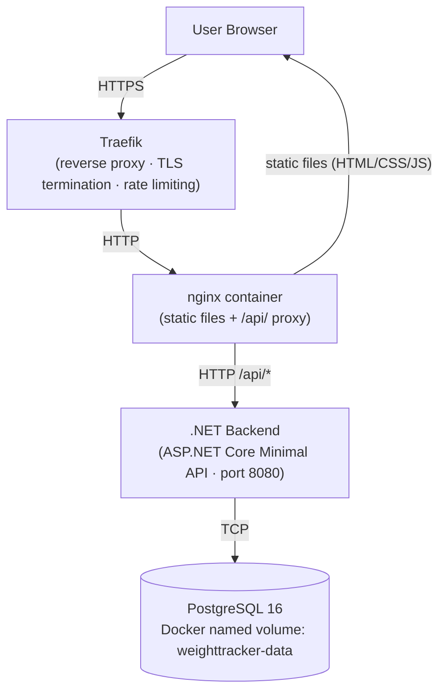
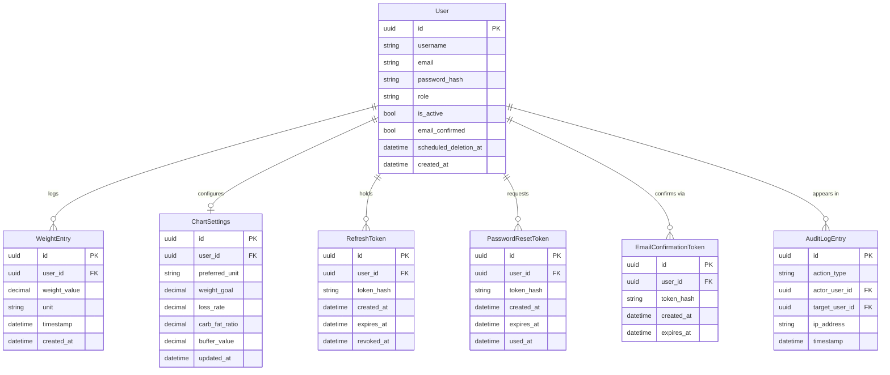

# Architecture

This document describes the system components, request flow, technology stack, and data model for Weight Tracker.

---

## System Overview

### Request flow

1. The user's browser connects to the server over HTTPS. Traefik terminates TLS using an automatically provisioned Let's Encrypt certificate.
2. Traefik forwards the decrypted request to the nginx container over HTTP on the internal Docker network.
3. nginx serves static files (HTML, CSS, JavaScript) directly. Requests to `/api/*` are proxied to the .NET backend on port 8080.
4. The backend processes the request — reading from or writing to PostgreSQL — and returns a JSON response.
5. All PostgreSQL data is stored in the Docker named volume `weighttracker-data`, which persists independently of container lifecycle.

### Rate limiting

Traefik applies per-IP rate limiting on two endpoints to prevent brute-force attacks:
- `POST /api/auth/login`
- `POST /api/auth/reset-password/request`

Default limits: 5 requests per minute average, burst of 10. Configurable via `AUTH_RATE_LIMIT_AVERAGE`, `AUTH_RATE_LIMIT_PERIOD`, and `AUTH_RATE_LIMIT_BURST` in `.env`.

---

## Technology Stack

| Layer | Technology | Rationale |
|-------|-----------|-----------|
| Frontend runtime | TypeScript 5.x + Vite 5.x | Type safety catches errors at compile time; Vite provides fast incremental builds and HMR |
| UI framework | Tailwind CSS v3 + DaisyUI v4 | Utility-first CSS eliminates stylesheet sprawl; DaisyUI supplies consistent, themeable components without a heavy JavaScript framework |
| Charts | Chart.js 4 + date-fns 3 | Mature time-series charting library; date-fns handles locale-aware date formatting without the bundle size of moment.js |
| Frontend server | nginx:alpine | Minimal static file server with negligible overhead; doubles as the `/api/` reverse proxy, removing the need for a separate proxy container |
| Backend language | C# 12 / .NET 8 | Type-safe, high-performance; Minimal API style reduces boilerplate compared to MVC controllers |
| Backend architecture | Ports & Adapters (Domain / Infrastructure / Api) | Isolates business logic from the framework and database; domain layer has zero external dependencies |
| ORM | EF Core 8 + Npgsql | First-class PostgreSQL support with code-first migrations; avoids raw SQL fragility for schema changes |
| Database | PostgreSQL 16 | Relational, ACID-compliant; well-supported pg_dump tooling for backups; suitable for the relational health-metric data model |
| Auth | JWT access tokens + HttpOnly cookie (refresh) | Stateless access tokens scale horizontally; HttpOnly SameSite cookie for refresh tokens protects against XSS token theft |
| Password hashing | BCrypt | Industry-standard adaptive cost; resistant to GPU-based brute-force via configurable work factor |
| Email | MailKit / SMTP | Delivers password-reset and email-confirmation messages via any standard SMTP provider; no vendor lock-in |
| Reverse proxy | Traefik v2.x | Docker-native label-based service discovery; automatic TLS via Let's Encrypt with zero static config per service |
| Containerisation | Docker Compose v2 | Single-file orchestration with health-check-ordered startup; appropriate complexity level for single-host self-hosting |

---

## Data Model

### Key entity notes

- **User**: `role` is either `user` or `admin`. `scheduled_deletion_at` is set when a user requests account deletion; a background process removes the record after the grace period (`USER_DELETION_GRACE_DAYS`).
- **WeightEntry**: `unit` is `kg` or `lbs`. Stored per-entry to support mixed-unit imports; displayed using the user's `preferred_unit` from ChartSettings.
- **RefreshToken**: Hashed before storage; the raw token is issued to the browser as an HttpOnly cookie and never stored in plaintext.
- **AuditLogEntry**: Append-only. Records admin actions (user creation, role changes, deletions) with actor and target user IDs.
